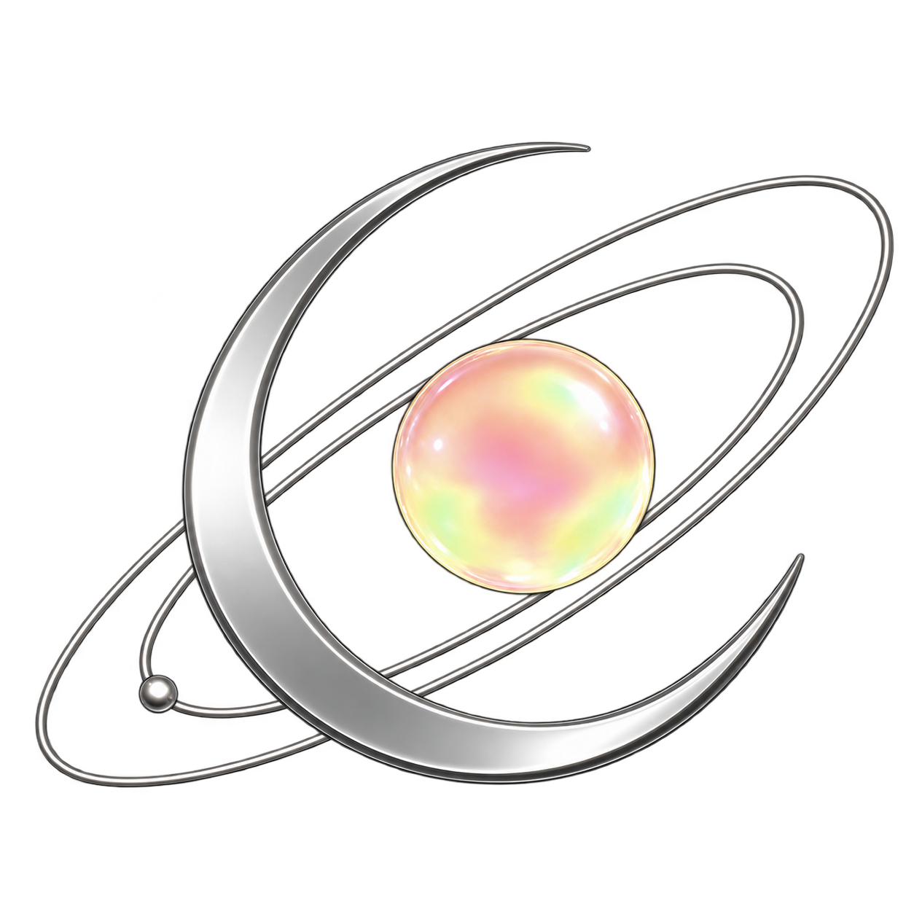
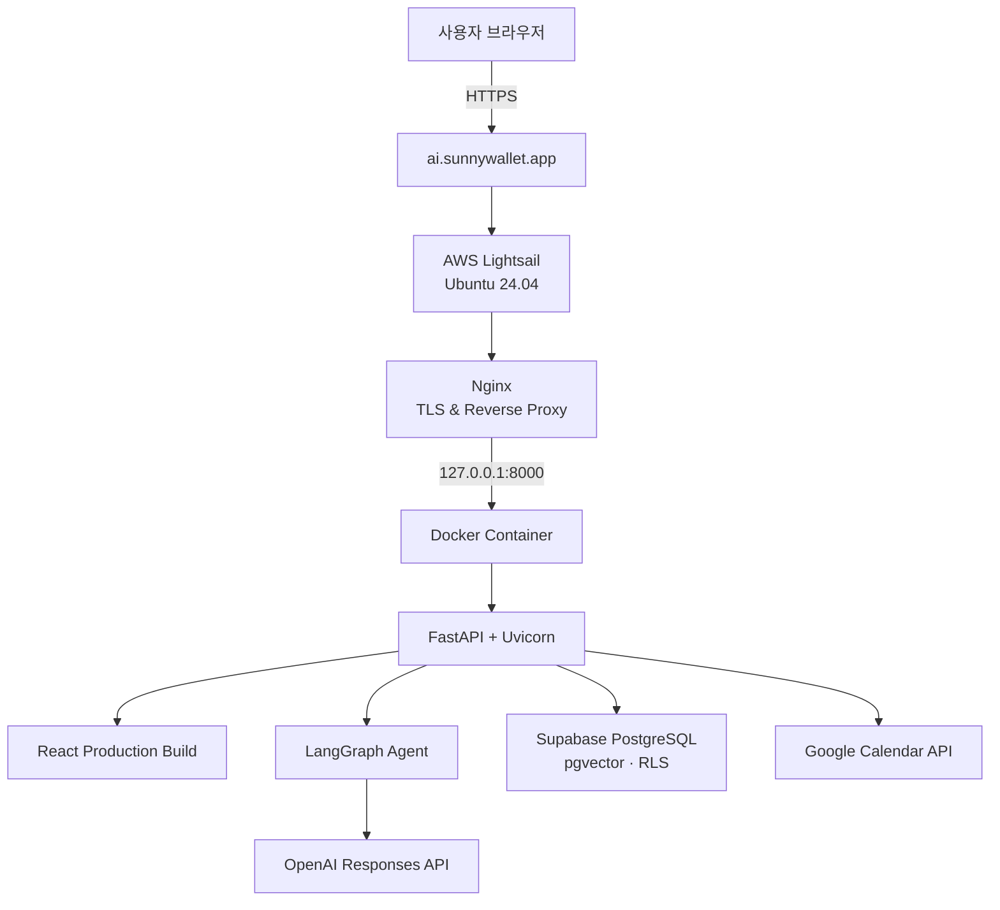

# PLANET Laura

> 사내 지식을 근거로 답하고, 사용자의 승인을 받아 실제 업무까지 수행하는 신입사원 온보딩 AI Agent

<p align="center">
  
</p>

<p align="center">
  <a href="https://ai.sunnywallet.app"><strong>Live Demo</strong></a>
  ·
  <a href="docs/PORTFOLIO.md"><strong>Portfolio Case Study</strong></a>
  ·
  <a href="https://ai.sunnywallet.app/docs"><strong>API Docs</strong></a>
</p>

PLANET Laura는 신입사원이 회사 정보와 업무 절차를 빠르게 이해하도록 돕는 웹 기반 AI Agent입니다. 사내 문서 RAG로 근거 있는 답변을 제공하고, 일정 등록과 체크리스트 변경처럼 상태를 바꾸는 작업은 반드시 사용자 승인 후 실행합니다.

이 저장소의 회사와 문서는 제품 시연을 위해 만든 가상 데이터입니다.

## 문제와 해결 방식

신입사원은 입사 직후 여러 문서와 담당자에게 흩어진 정보를 찾아야 합니다. 단순한 챗봇은 질문에는 답할 수 있지만 실제 업무를 처리하지 못하고, 근거가 부족한 답변이나 승인 없는 변경은 신뢰하기 어렵습니다.

Laura는 이 문제를 세 가지 방식으로 해결합니다.

1. **근거 있는 답변** — 관련 사내 문서를 검색·재정렬하고 접근 권한을 확인한 뒤 답변합니다.
2. **승인 기반 실행** — 조회는 즉시 처리하지만 일정 생성과 체크리스트 변경은 사용자 승인 후 실행합니다.
3. **업무 도구 연결** — 대화에서 날짜와 시간을 이해하고 Google OAuth를 거쳐 실제 Google Calendar에 일정을 등록합니다.

## 주요 기능

### 사내 문서 RAG

- 회사 소개, 연혁, 조직도, 담당 업무, 프로젝트, 팀별 주간 계획 검색
- 복지·사내 규정, 개발 환경, 휴가·결재 절차 안내
- 검색 결과 재정렬 및 문서별 팀 접근 권한 확인
- 답변 하단에 근거가 된 출처 문서명 표시
- 문서에 없는 정보는 추측하지 않고 `확인할 수 없습니다`로 응답

### LangGraph Agent와 Tool Calling

질문의 의도를 판단해 다음 도구 중 하나를 선택합니다.

| Tool | 역할 | 실행 정책 |
| --- | --- | --- |
| `search_company_documents` | 사내 문서 검색 | 즉시 실행 |
| `find_employee` | 임직원 소속 조회 | 즉시 실행 |
| `get_onboarding_progress` | 온보딩 진행률 조회 | 즉시 실행 |
| `get_current_projects` | 현재 프로젝트 조회 | 즉시 실행 |
| `update_checklist` | 체크리스트 상태 변경 | 승인 후 실행 |
| `create_schedule` | Google Calendar 일정 생성 | 승인 후 실행 |

- 도구 실행 실패 시 한 번 자동 재시도
- 날짜·시간·제목 등 필수 정보가 부족하면 필요한 내용만 재질문
- 대화 문맥을 이용해 `그 프로젝트`, `아까 말한 일정` 같은 후속 질문 처리
- Server-Sent Events로 판단·실행 상태와 답변을 스트리밍

### Google Calendar

```text
일정 생성 요청 → 날짜·시간 확인 → 승인 요청 → Google OAuth → Calendar API → 등록 완료
```

- 최초 실행 시 대화 흐름 안에서 Google 계정 연결
- Access/Refresh Token을 서버에서 암호화해 저장
- 승인한 일정만 생성하고 이벤트 ID와 링크를 작업 기록에 보관
- 실제 Google Calendar 일정 등록까지 검증 완료

### 온보딩과 팀 채팅

- 신입사원 소개와 초기 프로필 설정
- Laura 전용 1:1 AI 대화방
- AI 응답과 분리된 부서별 팀원 그룹 채팅
- 상위 Agent가 여러 팀 Agent에 작업을 전달하는 멀티 Agent 콘셉트 데모

## 서비스 아키텍처



Docker의 애플리케이션 포트는 외부에 노출하지 않고 `127.0.0.1:8000`에만 바인딩합니다. 외부 요청은 Nginx의 `80/443` 포트를 통해 전달됩니다.

## 기술 스택

| 영역 | 기술 |
| --- | --- |
| Frontend | React, Vite |
| Backend | FastAPI, Python 3.12, Uvicorn |
| AI Agent | LangGraph, OpenAI Responses API |
| Data | Supabase PostgreSQL, pgvector, Row Level Security |
| Auth | Supabase Anonymous Auth, HttpOnly Session Cookie |
| Integration | Google Calendar API, OAuth 2.0 |
| Infra | Docker, AWS ECR, AWS Lightsail, Nginx, Let's Encrypt |
| Test | Pytest |

## 핵심 설계 원칙

- **Grounded answer**: 검색된 문서 내용만 답변 컨텍스트로 전달합니다.
- **Human in the loop**: 외부 상태를 변경하는 작업은 승인 API를 분리해 실행합니다.
- **Least privilege**: 문서와 팀 채팅은 팀 단위 RLS 정책으로 접근 범위를 제한합니다.
- **Secret isolation**: OpenAI, Supabase, Google 비밀키는 백엔드 환경변수로만 관리합니다.
- **Graceful fallback**: 모델 또는 Tool Calling 실패 시 결정적 fallback 응답을 사용합니다.
- **Single deployable**: React 정적 빌드와 FastAPI를 하나의 Docker 이미지로 배포합니다.

## 프로젝트 구조

```text
.
├── src/                         # React 애플리케이션
│   ├── components/              # 온보딩, AI/팀 채팅, 승인 UI
│   └── services/                # FastAPI 통신 모듈
├── public/assets/               # 이미지와 오디오 리소스
├── backend/
│   ├── app/
│   │   ├── api/routes/          # REST/SSE API
│   │   ├── models/              # Pydantic 모델
│   │   └── services/            # Agent, RAG, Calendar, Repository
│   ├── scripts/                 # 문서 재색인 및 RAG 검증
│   └── tests/                   # API와 Agent 테스트
├── company-documents/           # PLANET mock 사내 문서 원본
├── supabase/migrations/         # 스키마, RLS, 문서 데이터
├── docs/PORTFOLIO.md            # 상세 포트폴리오 설명
└── Dockerfile                   # React + FastAPI multi-stage build
```

## 로컬 실행

### 요구 사항

- Node.js 20+
- Python 3.12+
- [uv](https://docs.astral.sh/uv/)
- Supabase 프로젝트
- OpenAI API 키
- Google Calendar 기능 사용 시 Google Cloud OAuth Web Client

### 1. 설치

```bash
git clone https://github.com/KimDSunny/planet-laura.git
cd planet-laura
npm install
cd backend && uv sync && cd ..
```

### 2. 환경변수

```bash
cp backend/.env.example backend/.env
```

`backend/.env`에 Supabase, OpenAI, Google OAuth 설정을 입력합니다. 전체 항목과 기본값은 [`backend/.env.example`](backend/.env.example)을 참고하세요.

개발용 비밀값 생성:

```bash
openssl rand -hex 32
cd backend
uv run python -c "from cryptography.fernet import Fernet; print(Fernet.generate_key().decode())"
```

첫 번째 값은 `GOOGLE_OAUTH_STATE_SECRET`, 두 번째 값은 `GOOGLE_TOKEN_ENCRYPTION_KEY`에 사용합니다. 실제 비밀값은 Git에 커밋하지 마세요.

### 3. Supabase

1. `Authentication → Sign In / Providers`에서 Anonymous Sign-In을 활성화합니다.
2. `supabase/migrations/`의 마이그레이션을 순서대로 적용합니다.
3. pgvector 확장과 RLS 정책 생성을 확인합니다.

Supabase CLI를 사용한다면 다음 명령으로 적용할 수 있습니다.

```bash
supabase db push
```

### 4. 개발 서버

터미널 1:

```bash
npm run dev:api
```

터미널 2:

```bash
npm run dev
```

- Web: `http://127.0.0.1:5173`
- API: `http://127.0.0.1:8000/api/v1`
- Swagger: `http://127.0.0.1:8000/docs`
- Health: `http://127.0.0.1:8000/api/v1/health`

로컬에서는 OAuth 쿠키와 콜백 호스트가 일치하도록 `localhost`와 `127.0.0.1`을 섞어 사용하지 않는 것이 좋습니다.

## 테스트

현재 백엔드 자동화 테스트 **49개**가 통과합니다. Agent 도구 선택, 승인 대기, 단일 재시도, RAG 출처, 권한 제한과 API 동작을 검증합니다.

```bash
npm run test:api
npm run build
```

회사 문서를 변경했다면 문장과 임베딩을 다시 동기화합니다.

```bash
cd backend
uv run python scripts/reindex_company_documents.py
uv run python scripts/verify_company_rag.py
```

## Docker

React를 먼저 빌드하고 결과물을 FastAPI 런타임에 포함하는 multi-stage 이미지입니다.

```bash
docker build -t planet-laura .
docker run --rm \
  --name planet-laura \
  --env-file backend/.env \
  -e FRONTEND_URL=http://127.0.0.1:8000 \
  -p 8000:8000 \
  planet-laura
```

Apple Silicon에서 AMD64 서버용 이미지를 만들 때:

```bash
docker buildx build \
  --platform linux/amd64 \
  -t planet-laura:amd64 \
  --load .
```

## 운영 배포

현재 서비스는 AWS Tokyo Region의 Lightsail Ubuntu 서버에서 운영합니다.

```text
GitHub → Docker build (linux/amd64) → Amazon ECR → Lightsail pull
       → Docker :8000 → Nginx :80/:443 → Let's Encrypt HTTPS
```

운영 환경에서 중요한 URL 설정:

```env
FRONTEND_URL=https://ai.sunnywallet.app
GOOGLE_OAUTH_REDIRECT_URI=https://ai.sunnywallet.app/api/v1/integrations/google-calendar/callback
```

서버의 환경변수 파일은 권한을 `600`으로 제한하고, 컨테이너는 `--restart unless-stopped` 및 `-p 127.0.0.1:8000:8000` 옵션으로 실행합니다.

## 보안

- 세션은 HttpOnly 쿠키로 관리합니다.
- 사용자 데이터와 팀 문서는 PostgreSQL RLS로 분리합니다.
- Google OAuth 토큰은 Fernet으로 암호화해 저장합니다.
- OAuth state를 검증해 위조된 콜백을 차단합니다.
- 일정과 체크리스트 변경은 사용자 승인 후에만 실행합니다.
- `.env`와 OAuth 비밀값은 `.gitignore`에서 제외합니다.
- 저장소와 데모 데이터에는 실제 회사 내부 정보가 포함되어 있지 않습니다.

## 프로젝트 상태

- [x] 사내 문서 RAG 및 출처 표시
- [x] LangGraph Tool Calling
- [x] 승인 기반 Calendar/Checklist 실행
- [x] Google Calendar OAuth 및 실제 일정 생성
- [x] Laura AI 채팅과 팀 그룹 채팅 분리
- [x] Docker 이미지 및 AWS 운영 배포
- [x] HTTPS와 커스텀 도메인 적용
- [ ] 멀티 Agent 오케스트레이션 실제 구현
- [ ] CI/CD 자동 배포 파이프라인

상세한 구현 배경, 기술적 의사결정과 트러블슈팅은 [포트폴리오 문서](docs/PORTFOLIO.md)에서 확인할 수 있습니다.
