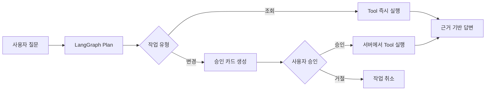
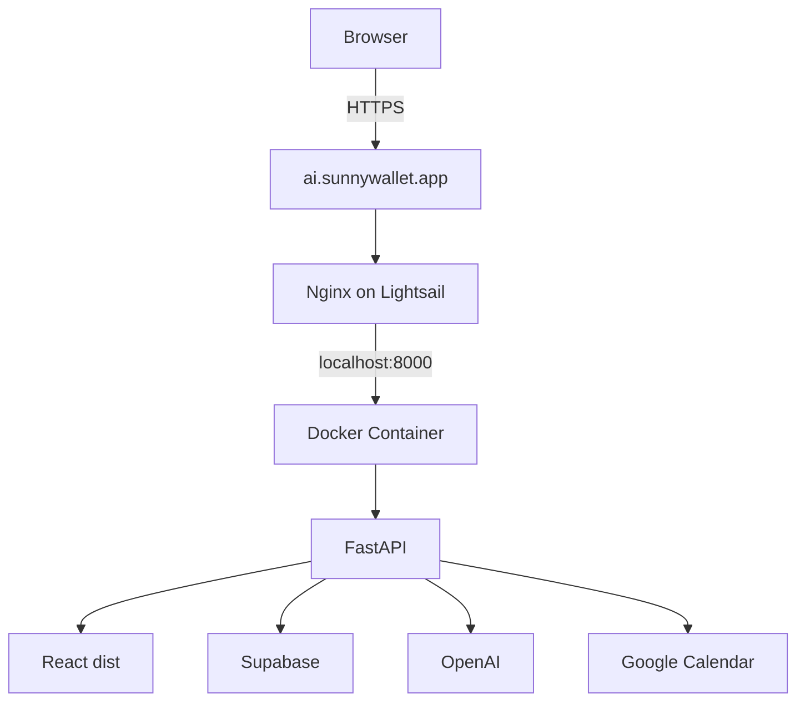

# PLANET Laura — Portfolio Case Study

## 한 줄 소개

PLANET Laura는 사내 문서를 기반으로 신입사원의 질문에 답하고, 승인받은 일정과 체크리스트 작업을 실제 외부 서비스에 실행하는 온보딩 AI Agent입니다.

- Live: [https://ai.sunnywallet.app](https://ai.sunnywallet.app)
- Repository: [github.com/KimDSunny/planet-laura](https://github.com/KimDSunny/planet-laura)
- 개발 범위: 기획, UI 구현, FastAPI API, RAG, Agent, Google OAuth, 데이터베이스, Docker/AWS 배포

> 제품에 등장하는 회사, 임직원, 프로젝트와 사내 문서는 포트폴리오 시연을 위해 만든 가상 데이터입니다.

## 프로젝트 배경

신입사원이 회사에 적응하려면 조직도, 담당자, 복지 규정, 개발 환경, 현재 프로젝트처럼 서로 다른 위치에 있는 정보를 반복해서 찾아야 합니다. 담당자에게 같은 질문이 계속 전달되고, 신입사원은 어떤 문서가 최신인지 판단하기 어렵습니다.

처음에는 사내 문서를 검색해 답하는 RAG 챗봇으로 시작했습니다. 그러나 실제 온보딩 과정에서는 정보를 아는 것만큼 일정을 잡거나 체크리스트를 갱신하는 행동도 중요했습니다. 그래서 Laura를 답변형 챗봇이 아니라, 다음 세 단계를 연결하는 Agent 제품으로 설계했습니다.

```text
회사 이해 → 업무 판단 → 승인받은 실행
```

## 목표

1. 사용자가 자연어로 회사 정보와 업무 절차를 물을 수 있을 것
2. 문서에 없는 내용은 만들어내지 않을 것
3. 조회와 변경 작업을 구분해 안전하게 실행할 것
4. 일정 등록 요청을 실제 Google Calendar 이벤트로 연결할 것
5. 로컬 데모가 아니라 HTTPS 도메인에서 사용할 수 있는 서비스로 배포할 것

## 사용자 경험

### 1. 회사 정보 질문

```text
사용자: 지금 어떤 프로젝트가 진행 중이야?
Laura: 관련 프로젝트를 간결하게 정리해 답변
        출처 문서명 표시
```

질문과 관련된 문서 청크를 검색하고 재정렬합니다. 사용자의 팀이 볼 수 있는 문서인지 확인한 뒤, 검색 근거만 OpenAI 모델에 전달합니다. 적절한 근거가 없으면 `확인할 수 없습니다`라고 답합니다.

### 2. 일정 등록

```text
사용자: 금요일 오후 3시에 보안 교육 일정 등록해줘
Laura: 해석한 날짜와 일정 내용을 보여주고 승인 요청
사용자: 승인
Laura: Google Calendar에 실제 이벤트 생성
```

일정 제목, 날짜, 시간이 부족하면 이미 받은 정보를 반복해서 묻지 않고 누락된 값만 확인합니다. 일정 생성은 모델의 Tool Calling만으로 바로 실행하지 않으며, 서버의 승인 API를 통과해야 합니다.

### 3. 팀 커뮤니케이션

Laura 채팅은 AI 응답 전용 공간이고, 부서별 채팅은 팀원 간 그룹 채팅입니다. 두 대화의 역할을 UI와 API에서 분리해 팀 채팅에서 AI가 답변하는 혼선을 제거했습니다.

## 시스템 설계

### Agent 실행 흐름



LangGraph 상태 그래프는 `plan → execute_tool` 흐름을 관리합니다. 모델은 도구와 인자를 선택하지만, 실제 변경 권한은 API 계층이 갖습니다. `create_schedule`과 `update_checklist`는 대기 상태의 Action을 만들고, 별도 승인 요청이 들어와야 실행됩니다.

### RAG 흐름

```text
질문
→ 문서 후보 검색
→ 질의 유형별 점수 재정렬
→ 팀별 문서 접근 권한 확인
→ 상위 근거를 답변 모델에 전달
→ 출처가 포함된 응답 저장
```

단순 키워드 일치로 휴가 문서와 복지 문서가 섞이는 문제를 줄이기 위해 질문 주제와 문서 주제에 가중치를 적용했습니다. 개발 환경 문서는 개발팀만 조회하도록 데이터베이스 정책과 Repository 계층에서 권한을 확인합니다.

### 인증과 데이터 분리

- 브라우저별 Supabase 익명 사용자를 생성합니다.
- 세션 식별자는 JavaScript에서 읽을 수 없는 HttpOnly 쿠키에 보관합니다.
- 프로필, 대화, Action, 팀 채팅과 OAuth 연결 정보는 사용자 또는 팀 기준 RLS 정책으로 분리합니다.
- Google Access/Refresh Token은 애플리케이션 키로 암호화한 뒤 저장합니다.

### 운영 구조



React와 FastAPI를 따로 배포하지 않고 multi-stage Docker build로 하나의 이미지에 합쳤습니다. FastAPI가 React의 `dist`를 제공하므로 동일 출처에서 웹과 API가 동작하고, 운영 구성과 OAuth 리디렉션이 단순해졌습니다.

## 주요 기술적 의사결정

### RAG 답변과 일반 대화 분리

모든 질문에 문서 검색 결과를 강제로 붙이면 인사말에도 불필요한 출처가 나타나고 답변이 부자연스러워졌습니다. 일반 대화는 모델이 짧게 직접 답하고, 사내 정보 질문만 검색 도구를 사용하도록 도구 설명과 시스템 지침을 구체화했습니다.

### 모델 호출과 실행 권한 분리

모델이 `create_schedule`을 선택했다고 해서 바로 캘린더를 변경하지 않습니다. 먼저 실행 예정 Action을 데이터베이스에 저장하고, 사용자가 승인한 Action ID만 서버가 실행합니다. 이 구조로 중복 클릭, 승인 없는 변경, UI 상태 불일치를 제어할 수 있었습니다.

### OAuth를 대화 흐름에 포함

별도의 설정 화면에서 캘린더를 미리 연결하도록 강요하지 않았습니다. 사용자가 처음 일정을 승인했을 때 연결이 없다면 Google OAuth로 이동하고, 콜백이 성공하면 대기 중이던 Action을 이어서 실행합니다.

### SSE 기반 응답 경험

Agent 판단과 도구 실행에는 일반 채팅보다 시간이 더 걸립니다. `/chat/stream`에서 처리 상태와 답변 문자를 Server-Sent Events로 전달해 사용자가 현재 상태를 알 수 있도록 했습니다.

### 단일 컨테이너 배포

포트폴리오 규모에서 프론트엔드와 백엔드를 별도 인프라로 운영하는 복잡도를 줄이기 위해 단일 컨테이너를 선택했습니다. Nginx가 TLS와 외부 연결을 담당하고, Docker 포트는 localhost에만 공개했습니다.

## 구현 중 해결한 문제

### 프로젝트 질문에 조직도 답변이 나오는 문제

`현재 어떤 프로젝트 진행 중이야?`라는 질문에 프로젝트가 아니라 기획팀 리드 정보가 선택되는 문제가 있었습니다. Tool 설명에서 프로젝트 조회와 인물 조회의 경계를 명확히 하고, 검색 재정렬에 프로젝트 주제 가중치를 적용해 해결했습니다.

### 답변 후 검색 상태가 계속 표시되는 문제

스트리밍 완료 이벤트와 UI 로딩 상태가 분리되어 있어 답변이 끝난 뒤에도 `사내 문서 검색 실행 중`이 남았습니다. 완료 이벤트에서 Agent 상태를 함께 초기화하고, 메시지 상태와 실행 상태의 생명주기를 맞췄습니다.

### OAuth `redirect_uri_mismatch`

로컬 콜백 주소와 운영 도메인의 콜백 주소가 달라 Google OAuth가 거절되었습니다. Google Cloud Console과 서버의 `GOOGLE_OAUTH_REDIRECT_URI`를 동일한 HTTPS 주소로 맞췄습니다.

```text
https://ai.sunnywallet.app/api/v1/integrations/google-calendar/callback
```

OAuth 완료 후 localhost로 이동하던 문제는 운영 서버의 `FRONTEND_URL`을 실제 도메인으로 설정해 해결했습니다.

### Apple Silicon 이미지의 서버 호환성

M1 Mac에서 기본 빌드한 ARM64 이미지는 AMD64 Lightsail 서버에서 실행할 수 없습니다. Buildx로 운영 이미지의 플랫폼을 명시했습니다.

```bash
docker buildx build --platform linux/amd64 -t planet-laura:amd64 --load .
```

### API만 보이고 React 화면이 나오지 않는 문제

초기 Docker 이미지는 FastAPI만 실행해 `/`에서 API 메시지만 반환했습니다. Dockerfile을 multi-stage build로 변경하고 React `dist`를 런타임 이미지에 복사한 뒤 FastAPI가 정적 파일을 제공하도록 수정했습니다.

## 안전성과 신뢰성

| 위험 | 대응 |
| --- | --- |
| 문서에 없는 답변 생성 | 검색 근거가 없으면 `확인할 수 없습니다` 반환 |
| 승인 없는 외부 변경 | 변경 Tool을 승인 API와 분리 |
| 일시적 Tool/API 실패 | 한 번 자동 재시도 후 오류 응답 |
| 팀 문서·대화 노출 | Supabase RLS와 팀 권한 검사 |
| OAuth 토큰 노출 | 서버 저장 및 Fernet 암호화 |
| 비밀키 저장소 유출 | 서버 전용 환경변수와 `.gitignore` 사용 |
| 컨테이너 포트 직접 노출 | localhost 바인딩 후 Nginx만 공개 |

## 검증

- 백엔드 자동화 테스트 49개 통과
- Agent 도구 선택과 승인 대기 상태 테스트
- 변경 작업이 승인 전 실행되지 않는지 테스트
- Tool 실패 후 단일 재시도 테스트
- 문서가 없는 질문의 거절 응답 테스트
- 팀 전용 문서 접근 제한 테스트
- RAG 재정렬과 프로젝트 후속 질문 테스트
- Google OAuth 연결 후 실제 Calendar 일정 생성 확인
- React production build 및 AMD64 Docker 실행 확인
- 커스텀 도메인과 HTTPS 운영 접속 확인

## 결과와 배운 점

이 프로젝트를 통해 LLM 애플리케이션의 핵심은 모델을 호출하는 코드보다 **어떤 정보만 답변 근거로 허용할지**, **어떤 행동에 사용자 승인이 필요한지**, **실패와 재시도를 어디에서 관리할지**를 정하는 데 있다는 점을 확인했습니다.

또한 로컬에서 동작하는 기능을 실제 제품 형태로 완성하려면 OAuth 콜백, 쿠키, HTTPS, 컨테이너 아키텍처, 비밀값 관리와 같은 운영 조건을 애플리케이션 설계 단계부터 함께 고려해야 한다는 것을 배웠습니다.

## 향후 개선

- 상위 Laura Agent와 팀별 전문 Agent를 연결하는 실제 멀티 Agent 오케스트레이션
- 문서 업로드와 자동 청킹·임베딩 관리 화면
- RAG 정답 데이터셋과 자동 평가 파이프라인
- OpenTelemetry 기반 Agent 실행 추적 및 비용 관측
- GitHub Actions 기반 테스트·이미지 빌드·배포 자동화
- 운영 사용자 인증과 조직 단위 멀티테넌시
